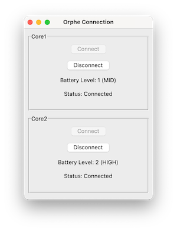

# ORPHE-CORE.py
Happy hacking for ORPHE CORE with python!!

https://github.com/Orphe-OSS/ORPHE-CORE.py/assets/1846131/03c5f199-9a54-4307-a014-56b48d3ba373

## Requirements
 * Python 3.10 or later

## Installation
```bash
git clone https://github.com/Orphe-OSS/ORPHE-CORE.py.git
cd ORPHE-CORE.py
pip install bleak
```

## 動作確認

### LEDを点滅させる
以下を実行して、センサデバイスのLEDが点滅することを確認してください。
終了する場合は`Ctrl+C`で終了できます。
```bash
python blink_led.py
```

### sensor valuesの値を取得する
加速度センサ、ジャイロセンサ、クオータニオンセンサの値を取得することができます。
以下を実行して、sensor valuesの値を取得することができます。
終了する場合は`Ctrl+C`で終了できます。
```bash
python get_sensor_values.py
```

### step analysisの値を取得する
以下を実行して、step analysisの値を取得することができます。
終了する場合は`Ctrl+C`で終了できます。
```bash
python get_step_analysis.py
```

### 周りのBLEデバイスをスキャンする
コアモジュールを特定のデバイスに接続したい場合は、orphe.connect()の引数にデバイスのアドレスを指定することができます。これを利用するにあたって、特定のコアモジュールのアドレスを知りたい場合は以下を実行して周りのBLEデバイスをすべてスキャンすることができます。
```bash
python scan_ble_devices.py
```

### device informationを取得する
device_information.py にコアモジュールの情報を取得するサンプルコードがあります。以下を実行して、コアモジュールの情報を取得することができます。
```bash
python device_information.py
```

### matplotlibを利用してデータを可視化する
`plot_sensor_values.py`を実行することで、取得したセンサデータをmatplotlibを利用してリアルタイムに可視化することができます。初期設定では加速度値を可視化していますが、他のデータを可視化したい場合は適宜変更してください。
```bash
pip install matplotlib
python plot_sensor_values.py
```

### OSCでデータを送信する
`oscHub.py`を実行することで、ORPHE COREから取得したデータをOSCで送信することができます。初期設定では5005番のポートに送信します。なおoscHub.pyは加速度値のみをoscで送信していますので、他のデータを送信したい場合は適宜変更してください。
```bash
pip install python-osc
python osc.py
```

具体的なアプリケーション側での受信方法については [OSCで様々なアプリケーションにデータをリアルタイム送信する](https://github.com/Orphe-OSS/ORPHE-CORE.py/wiki/%E7%95%AA%E5%A4%96%E7%B7%A8.-OSC%E3%81%A7%E6%A7%98%E3%80%85%E3%81%AA%E3%82%A2%E3%83%97%E3%83%AA%E3%82%B1%E3%83%BC%E3%82%B7%E3%83%A7%E3%83%B3%E3%81%AB%E3%83%87%E3%83%BC%E3%82%BF%E3%82%92%E3%83%AA%E3%82%A2%E3%83%AB%E3%82%BF%E3%82%A4%E3%83%A0%E9%80%81%E4%BF%A1%E3%81%99%E3%82%8B)を参照してください

### GUIを利用してCOREと接続する


`gui.py`にORPHE COREの接続や切断をgui上から実行できます。非常にシンプルなアプリケーションですが、coreの電波状況による接続解除や手動接続解除、バッテリーレベル表示等を実装しています。guiには tkinter というpythonの標準ライブラリを利用していますので、追加のインストールは不要です。フロントユーザレベルアプリケーション開発の参考にしてください。またOSCと組み合わせることで簡単なOSC送信アプリケーションも作成できます。

```bash
python gui.py
```

## ドキュメント
  * [ORPHE CORE Python API Reference](https://orphe-oss.github.io/ORPHE-CORE.py/api/orphe_core.html)

### 生成方法
orphe_core.pyのdocstringからドキュメントを生成します。htmlファイルの生成には pdoc3 を利用しています。orphe_core.pyのdocstringを書き換えたり、機能を追加した場合は以下のコマンドでドキュメントを再生成してください。
```bash
pip install pdoc3
pdoc orphe_core --html -o docs/api --force
```

## Compatibility
 * ORPHE CORE 50Hz、200Hzモデルに対応していますが、50Hzモデルではsensor valuesにおける加速度、ジャイロ、クオータニオンのタイムスタンプやシリアル番号、パケット番号は利用することができません。これはファームウェアの仕様によるものです。